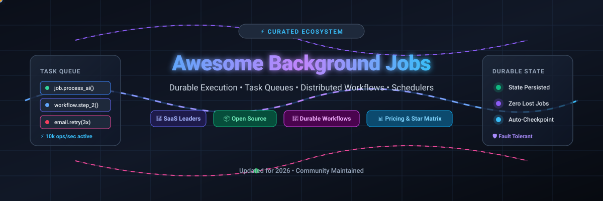
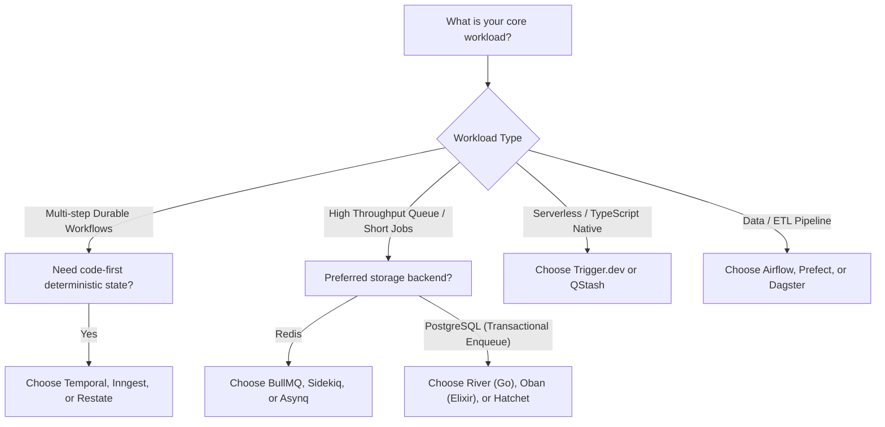



  

  
  
  
  
  
  
  

---

# 🚀 Awesome Background Job Platforms & Durable Execution

> 🌟 **A curated, battle-tested list of SaaS products, distributed task queues, durable workflow engines, event-driven schedulers, and open-source background processing frameworks.**

*Keywords: Background Jobs, Task Queues, Durable Workflows, Microservices Orchestration, Event-Driven Execution, Distributed Systems, Asynchronous Processing, Schedulers, Redis Queues, PostgreSQL Queues, AI Pipelines, Zero-Data-Loss Processing.*

📅 **Last updated: August 2026**

---

## 📖 Table of Contents

- [✨ Overview & Architecture Guide](#-overview--architecture-guide)
- [☁️ SaaS & Hosted Platforms](#-saas--hosted-platforms)
- [📦 Open-Source GitHub Projects](#-open-source-github-projects)
- [🗺️ Ecosystem Matrix by Language](#%EF%B8%8F-ecosystem-matrix-by-language)
- [🎯 Choosing the Right Architecture](#-choosing-the-right-architecture)
- [🤝 How to Contribute](#-how-to-contribute)
- [📈 Star History](#-star-history)
- [📜 Disclaimer & Best Practices](#-disclaimer--best-practices)

---

## ✨ Overview & Architecture Guide

Modern applications rely heavily on **asynchronous execution** and **durable state engines** to handle mission-critical workloads beyond the HTTP request lifecycle:
- ✉️ **Transactional Notifications & Webhooks**: Retrying with exponential backoff and dead-letter queues (DLQ).
- 🤖 **AI & LLM Pipelines**: Long-running model inference, multi-agent chaining, step checkpointing, and human-in-the-loop workflows.
- 🔄 **Durable Workflows**: Multi-step business processes that can sleep for days, survive node crashes, and resume seamlessly.
- ⚡ **High-Throughput Task Queues**: Ingesting millions of events per second with concurrency control, priority weighting, and deduplication.

---

## ☁️ SaaS & Hosted Platforms

*Managed cloud platforms sorted descending by company scale (Valuation / Market Cap / Revenue).*

| 🏢 Platform | 📝 Description | 📊 Company Size / Valuation | 💵 Starting Price | 🎁 Free Tier / Trial Limit |
| :--- | :--- | :--- | :--- | :--- |
| **[Google Cloud Tasks](https://cloud.google.com/tasks)** | ⚡ Fully managed asynchronous task queue service executing HTTP and App Engine targets with Google-scale infrastructure. | **~$2.1T+ Market Cap** *(Alphabet Inc., $40B+ Cloud ARR)* | **$0.40 per 1M operations** *(after monthly free tier)* | **1,000,000 billable ops/month free** *(32 KB chunk size, unlimited queues)* |
| **[Temporal Cloud](https://temporal.io/)** | 🛡️ Fully managed service for Temporal's durable workflow engine, providing enterprise-grade multi-language orchestration. | **~$1.5B+ – $5B Valuation** *(Unicorn, $300M+ Series D)* | **$100/month** *(Essentials plan: 1M actions, 1GB active / 40GB retained storage)* | **30-day Free Trial with $1,000 credits** *(No perpetual free tier; $6k credits for startups)* |
| **[QStash (Upstash)](https://upstash.com/qstash)** | 📡 Serverless message queue and scheduler designed for HTTP-based background jobs, pub/sub, and durable workflow endpoints. | **~$40M–$60M Est. Valuation** *($12.5M Series A raised)* | **$1.00 per 100k messages** *(Pay-as-you-go; fixed plans from $180/mo)* | **500 messages/day free forever** *(100 KB payload size limit, soft rate limits)* |
| **[Restate](https://restate.dev/)** | 🔄 Durable execution runtime and distributed event service providing resilient state machines and virtual actors. | **~$30M–$50M Est. Valuation** *($7M Seed raised from Redpoint/YC)* | **$75/month** *(Paid tiers with volume tiers; BYOC reserved capacity)* | **50,000 durable actions/month free** *(2 environments per user, no credit card required)* |
| **[Inngest](https://www.inngest.com/)** | ⚡ Event-driven durable functions and step-workflow platform running across existing serverless infrastructure and containers. | **~$25M–$40M Est. Valuation** *($6.1M Seed/Series A from a16z)* | **$99/month** *(Pro plan: 1M executions, 100+ concurrent steps)* | **50,000 executions/month free** *(5 concurrent steps, 24-hr history, 1-hr lookback)* |
| **[Trigger.dev](https://trigger.dev/)** | 🛠️ TypeScript-first background jobs platform with real-time logs, AI workflow support, and sub-second cold starts. | **~$15M–$25M Est. Valuation** *($3M+ Seed raised from YC/funds)* | **$10/month** *(Hobby plan includes $10 usage credits; $0.25/10k runs + compute)* | **$5/month usage credits free** *(20 concurrent prod runs, 10k queued tasks, 1.5k req/min)* |
| **[Hatchet](https://hatchet.run/)** | 🏎️ Ultra-low-latency distributed task queue and workflow engine designed for high throughput, Python/TS, and AI pipelines. | **~$15M–$25M Est. Valuation** *(Venture-backed Seed)* | **$500/month** *(Team plan, 10 users, 500 RPS; $10/1M task overage)* | **100,000 task runs/month free** *(Full API/SDK access & web dashboard on Dev tier)* |
| **[IronWorker](https://www.iron.io/)** | 🐳 Multi-language containerized cloud worker platform for scheduled jobs, batch processing, and event-driven workloads. | **~$15M–$20M Est. Valuation** *($14.5M venture raised / Growth)* | **$29/month** *(Basic +1 concurrency)* / **$169/month** *(Standard cluster)* | **Free Basic plan** *(1 concurrency, 5 hrs/mo, 512MB RAM, 50 tasks)* + 14-day trial |
| **[Sidekiq Enterprise](https://sidekiq.org/)** | 💎 Commercial multi-threaded background job framework for Ruby with rolling restarts, periodic cron, and unique jobs. | **~$3M–$5M ARR** *(100% Bootstrapped & Highly Profitable)* | **$99/month** *(Pro)* / **$269/month** *(Enterprise, 100 worker threads)* | **No free hosted tier** *(30-day money-back evaluation policy; OSS core is free)* |
| **[BullMQ Pro](https://bullmq.io/)** | 🐂 Enterprise commercial extensions for BullMQ adding observable streams, parent-child flows, and round-robin group batching. | **~$1M–$2M ARR** *(100% Bootstrapped & Profitable)* | **$139/month** *(or $1,395/year per organization license)* | **14-day Free Trial** *(Requestable trial token; open-source BullMQ is free)* |

---

## 📦 Open-Source GitHub Projects

*Leading open-source task queues, schedulers, and workflow orchestration engines, sorted descending by GitHub stars.*

1. **[Apache Airflow](https://github.com/apache/airflow)**   
   🌐 Python • De-facto industry standard programmatic data workflow orchestration platform for scheduling, authoring, and monitoring complex DAGs.

2. **[Celery](https://github.com/celery/celery)**   
   🐍 Python • Battle-tested distributed task queue supporting RabbitMQ, Redis, Amazon SQS, and RPC brokers with real-time operations.

3. **[Prefect](https://github.com/PrefectHQ/prefect)**   
   🚀 Python • Modern orchestration and observability framework built for resilient dynamic data pipelines, background tasks, and ML workflows.

4. **[Temporal](https://github.com/temporalio/temporal)**   
   🛡️ Polyglot (Go/Java/TS/Python) • The gold-standard durable execution platform making failures invisible via deterministic event sourcing.

5. **[Windmill](https://github.com/windmill-labs/windmill)**   
   ⚡ Rust/Polyglot • Extremely fast open-source developer platform for turning scripts into background workflows, UIs, and scheduled jobs.

6. **[Bull](https://github.com/OptimalBits/bull)**   
   🟡 Node.js • The classic, ultra-fast Redis-backed background job and message queue for NodeJS microservices.

7. **[Trigger.dev](https://github.com/triggerdotdev/trigger.dev)**   
   📘 TypeScript • Developer-first open-source background jobs framework with checkpointing, AI workflow SDK, and long-running execution.

8. **[Dagster](https://github.com/dagster-io/dagster)**   
   📊 Python • Cloud-native data orchestrator designed for software-defined assets, background data computation, and machine learning.

9. **[Sidekiq](https://github.com/sidekiq/sidekiq)**   
   💎 Ruby • Simple, efficient multi-threaded background processing framework for Ruby, powered by Redis and trusted across thousands of production sites.

10. **[Asynq](https://github.com/hibiken/asynq)**   
    🔷 Go • Simple, reliable, and efficient distributed task queue in Go powered by Redis with priority weighting and periodic scheduling.

11. **[RQ (Redis Queue)](https://github.com/rq/rq)**   
    🐍 Python • Lightweight, straightforward Python library for queueing jobs and processing them asynchronously with Redis.

12. **[Agenda](https://github.com/agenda/agenda)**   
    🟢 Node.js • Lightweight MongoDB-backed job scheduling and queueing engine with cron syntax support and promise-based APIs.

13. **[BullMQ](https://github.com/taskforcesh/bullmq)**   
    🟦 TypeScript/Node.js/Python • Modern, highly scalable distributed message and job queue supporting Redis and PostgreSQL backends.

14. **[Machinery](https://github.com/RichardKnop/machinery)**   
    🔷 Go • Asynchronous task queue/job queue based on distributed message passing (Redis, RabbitMQ, Memcache, DynamoDB).

15. **[Hatchet](https://github.com/hatchet-dev/hatchet)**   
    🏎️ Go/Postgres • High-throughput, low-latency distributed task queue and workflow engine designed to replace legacy queues with modern DX.

16. **[APScheduler](https://github.com/agronholm/apscheduler)**   
    🐍 Python • Advanced Python scheduler library that lets you schedule tasks dynamically (interval, cron, date) with persistent backends.

17. **[Faktory](https://github.com/contribsys/faktory)**   
    🌍 Polyglot • Language-agnostic background job server from the author of Sidekiq, using JSON over a TCP socket protocol.

18. **[Inngest](https://github.com/inngest/inngest)**   
    🔄 Go/TypeScript/Python • Open-source durable execution engine for step-functions, event-driven retries, and cross-service orchestration.

19. **[River](https://github.com/riverqueue/river)**   
    🔷 Go/Postgres • Fast, robust, and modern background job queue for Go backed by PostgreSQL with transactional enqueueing.

20. **[Dramatiq](https://github.com/Bogdanp/dramatiq)**   
    🐍 Python • Fast, reliable alternative to Celery focused on simplicity, actor-model abstractions, and Redis/RabbitMQ brokers.

21. **[Huey](https://github.com/coleifer/huey)**   
    🐍 Python • Little, multi-threaded task queue for Python with lightweight Redis or SQLite backing and minimal dependencies.

22. **[Restate](https://github.com/restatedev/restate)**   
    🔄 Rust/Polyglot • Durable execution engine enabling failure-resilient distributed applications without managing saga orchestrators.

23. **[Oban](https://github.com/oban-bg/oban)**   
    🟣 Elixir/Postgres • Robust, transactional background job processing framework for Elixir and Phoenix, leveraging PostgreSQL `LISTEN/NOTIFY`.

24. **[Bee-Queue](https://github.com/bee-queue/bee-queue)**   
    🟢 Node.js • High-performance, short-job-focused Redis background task queue for Node.js.

---

## 🗺️ Ecosystem Matrix by Language

| 💻 Primary Language | 📦 Open-Source Frameworks | ☁️ Managed SaaS Solutions |
| :--- | :--- | :--- |
| **Python** 🐍 | [Celery](https://github.com/celery/celery), [Airflow](https://github.com/apache/airflow), [Prefect](https://github.com/PrefectHQ/prefect), [Dagster](https://github.com/dagster-io/dagster), [RQ](https://github.com/rq/rq), [APScheduler](https://github.com/agronholm/apscheduler), [Dramatiq](https://github.com/Bogdanp/dramatiq), [Huey](https://github.com/coleifer/huey) | [Temporal Cloud](https://temporal.io/), [Inngest](https://www.inngest.com/), [Hatchet](https://hatchet.run/) |
| **TypeScript / JS** 📘 | [Trigger.dev](https://github.com/triggerdotdev/trigger.dev), [BullMQ](https://github.com/taskforcesh/bullmq), [Bull](https://github.com/OptimalBits/bull), [Agenda](https://github.com/agenda/agenda), [Bee-Queue](https://github.com/bee-queue/bee-queue) | [Trigger.dev Cloud](https://trigger.dev/), [Inngest](https://www.inngest.com/), [QStash](https://upstash.com/qstash) |
| **Go** 🔷 | [Temporal](https://github.com/temporalio/temporal), [Asynq](https://github.com/hibiken/asynq), [River](https://github.com/riverqueue/river), [Machinery](https://github.com/RichardKnop/machinery), [Hatchet](https://github.com/hatchet-dev/hatchet) | [Temporal Cloud](https://temporal.io/), [Hatchet Cloud](https://hatchet.run/) |
| **Ruby** 💎 | [Sidekiq](https://github.com/sidekiq/sidekiq), [Faktory](https://github.com/contribsys/faktory) | [Sidekiq Enterprise](https://sidekiq.org/) |
| **Elixir** 🟣 | [Oban](https://github.com/oban-bg/oban) | [Oban Pro / Web](https://getoban.pro/) |
| **Polyglot / Distributed** 🌐 | [Temporal](https://github.com/temporalio/temporal), [Restate](https://github.com/restatedev/restate), [Windmill](https://github.com/windmill-labs/windmill), [Faktory](https://github.com/contribsys/faktory) | [Temporal Cloud](https://temporal.io/), [Restate Cloud](https://restate.dev/), [Google Cloud Tasks](https://cloud.google.com/tasks) |

---

## 🎯 Choosing the Right Architecture

### 💡 Key Selection Criteria
1. **Durable Step Execution**: If your workflow consists of multiple sequential steps, sleeps for hours/days, or requires automatic state checkpointing, use **Temporal**, **Inngest**, or **Restate**.
2. **Transactional Enqueueing**: If you need background jobs to be committed in the exact same database transaction as your business records (preventing ghost/lost jobs), select **River**, **Oban**, or **Hatchet**.
3. **Low-Latency / High Concurrency**: If you are pushing 100,000+ jobs/min with minimal overhead, use **BullMQ**, **Sidekiq**, or **Asynq**.
4. **Serverless HTTP Endpoints**: If you run on Vercel/Cloudflare/AWS Lambda and cannot maintain long-lived worker pools, use **QStash** or **Trigger.dev**.

---

## 📈 Star History

---

## 🤝 How to Contribute

We welcome community contributions! Please help keep this guide up-to-date and accurate:

1. 🍴 **Fork the repository** on GitHub.
2. ✏️ **Edit `README.md`**: Follow existing table and formatting standards.
3. 🔍 **Verify Data**: Ensure pricing details, free tier quotas, and links point directly to canonical official sources.
4. 🚀 **Submit a Pull Request** with a concise description of your additions.

---

## 📜 Disclaimer & Best Practices

- ⚖️ *This is an independent, community-maintained list. Product names, logos, and trademarks belong to their respective owners.*
- 🛡️ **Idempotency is mandatory**: Always design background jobs with unique idempotency keys so that retries never produce duplicate charges or side effects.
- 📬 **Dead-Letter Handling**: Ensure poisoned messages are routed to a DLQ and monitored with alerting.

---

  <b>Built with ❤️ by backend engineers for platform teams and distributed systems developers.</b>

